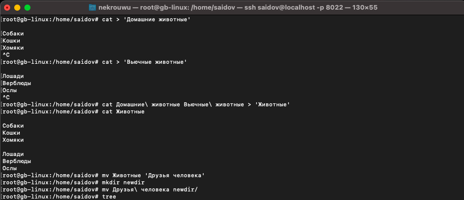
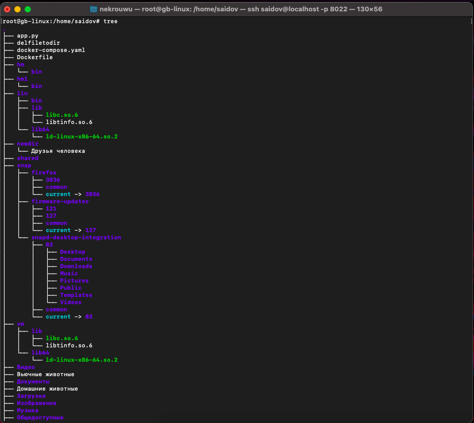
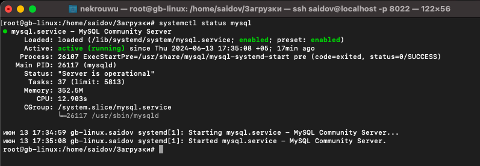
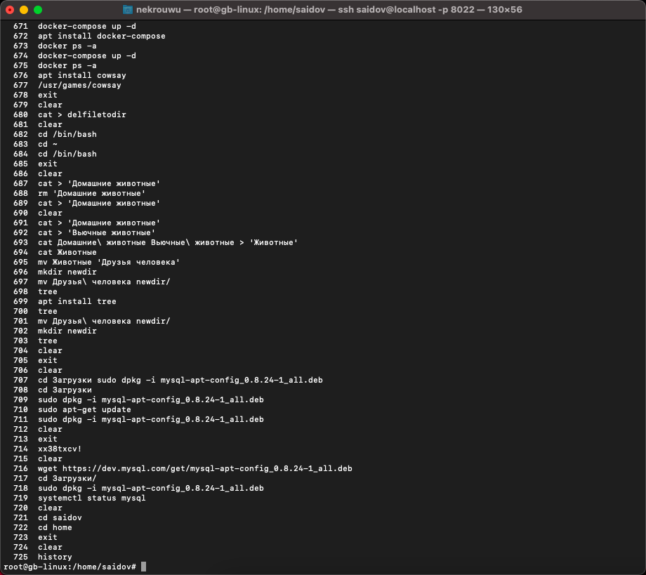
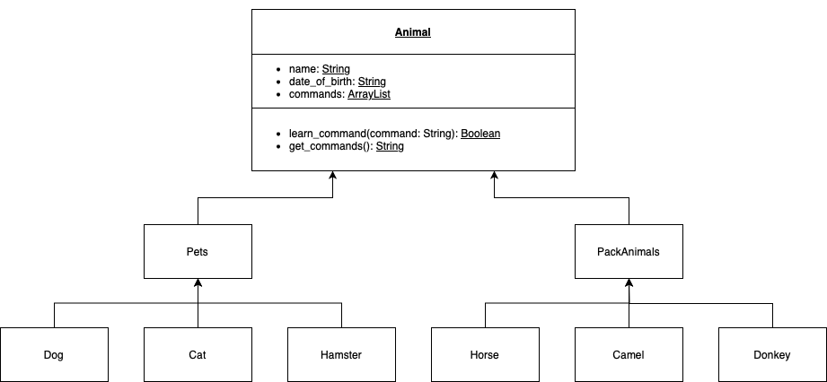
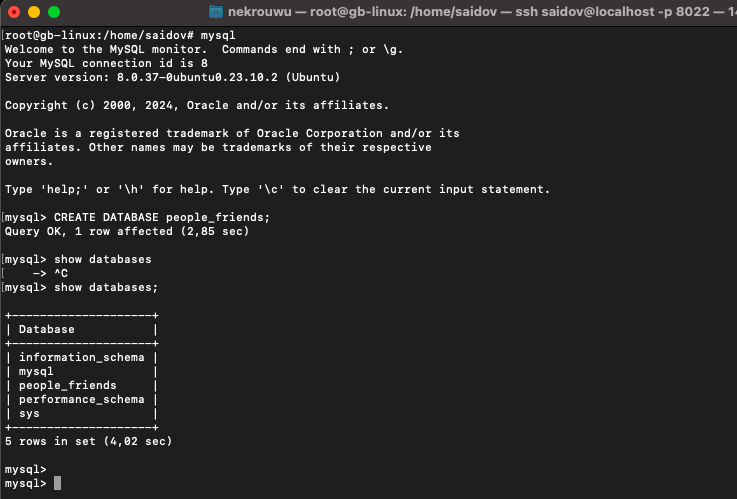

# GeekBrains_final_cert_01.2024
Итоговая контрольная работа по блоку специализация

# `Итоговая контрольная работа`

## `Основное задание`
Организуйте систему учёта для питомника, в котором живут домашние и вьючные животные.

## `Задание`

### 1. Используя команду cat в терминале операционной системы Linux, создать два файла Домашние животные (заполнив файл собаками, кошками, хомяками) и Вьючные животными (заполнив файл Лошадьми, верблюдами и ослы), а затем объединить их. Просмотреть содержимое созданного файла. Переименовать файл, дав ему новое имя (Друзья человека).

cat > 'Домашние животные'

В файле указываем:
Собаки
Кошки
Хомяки

cat > 'Вьючные животные'

В файле указываем:
Лошади
Верблюды
Ослы

cat 'Домашние животные' 'Вьючные животные' > Животные

ls

mv Животные 'Друзья человека'

ls

### 2. Создать директорию, переместить файл туда.

mkdir newdir

mv 'Друзья человека' newdir/

ls

### 3. Подключить дополнительный репозиторий MySQL. Установить любой пакет из этого репозитория.

Скачиваем конфигуратор mysql:

wget https://dev.mysql.com/get/mysql-apt-config_0.8.24-1_all.deb

Переходим в папку Загрузки и устанавливаем компоненты mysql с помощью конфигуратора:

cd Загрузки
sudo dpkg -i mysql-apt-config_0.8.24-1_all.deb

Жмем Ок, чтобы выполнить полную установку

Обновляем информацию о пакетах и видим подключенный репозиторий mysql:

sudo apt-get update

Устанавливаем mysql-server:

sudo apt-get install mysql-server

Проверяем результат установки:

systemctl status mysql

### 4. Установить и удалить deb-пакет с помощью dpkg.

Скачиваем пакет для установки:

wget https://dev.mysql.com/get/Downloads/Connector-J/mysql-connector-j_8.0.32-1ubuntu22.04_all.deb

Устанавливаем пакет mysql-connector-j_8.0.32-1ubuntu22.04_all.deb:

sudo dpkg - i mysql-connector-j_8.0.32-1ubuntu22.04_all.deb

Удаляем пакет и его дополнительные пакеты:

sudo dpkg -r mysql-connector-j

sudo apt-get autoremove

### 5. Выложить историю команд в терминале ubuntu

Для получения истории введенных команд в терминале ubuntu используем:

history

### 6. Нарисовать диаграмму, в которой есть класс родительский класс, домашние животные и вьючные животные, в составы которых в случае домашних животных войдут классы: собаки, кошки, хомяки, а в класс вьючные животные войдут: лошади, верблюды и ослы.

### 7. В подключенном MySQL репозитории создать базу данных “Друзья человека”

### 8. Создать таблицы с иерархией из диаграммы в БД.

### 9. Заполнить низкоуровневые таблицы именами (животных), командами, которые они выполняют, и датами рождения.

### 10. Удалив из таблицы верблюдов, т.к. верблюдов решили перевезти в другой питомник на зимовку, объединить таблицы лошади и ослы в одну таблицу.

### 11. Создать новую таблицу “молодые животные”, в которую попадут все животные старше 1 года, но младше 3 лет и в отдельном столбце с точностью до месяца подсчитать возраст животных в новой таблице.

### 12. Объединить все таблицы в одну, при этом сохраняя поля, указывающие на прошлую принадлежность к старым таблицам.

[Код SQL 8-12 заданий](sql_code.sql)

### 13. Создать класс с Инкапсуляцией методов и наследованием по диаграмме.

[Class](Animals)

### 14. Написать программу, имитирующую работу реестра домашних животных.
В программе должен быть реализован следующий функционал:

#### 14.1. Завести новое животное
#### 14.2. Определять животное в правильный класс
#### 14.3. Увидеть список команд, которое выполняет животное
#### 14.4. Обучить животное новым командам

### 15. Создайте класс Счетчик, у которого есть метод add(), увеличивающий значение внутренней int переменной на 1 при нажатии "Завести новое животное". Сделайте так, чтобы с объектом такого типа можно было работать в блоке try-with-resources. Нужно бросить исключение, если работа с объектом типа счетчик была не в ресурсном try и/или ресурс остался открыт. Значение считать в ресурсе try, если при заведении животного заполнены все поля.
